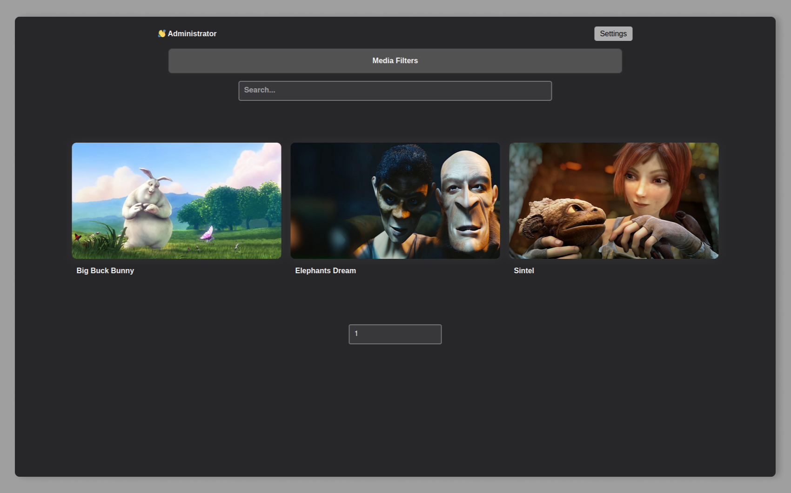
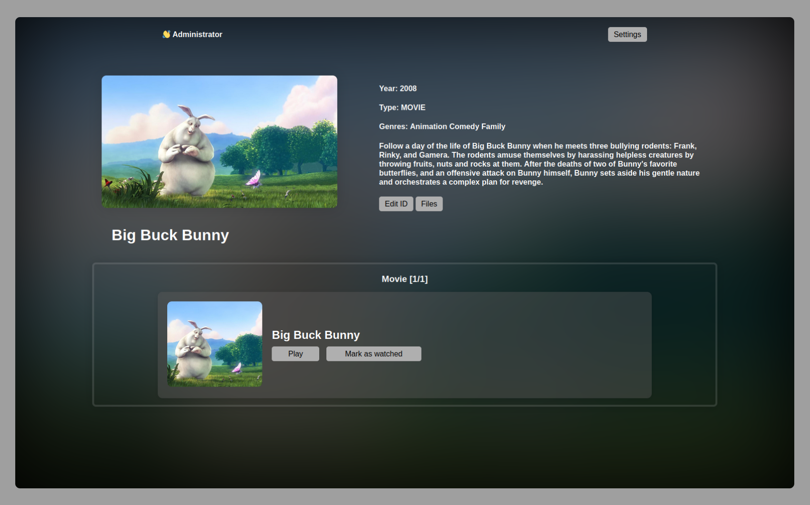
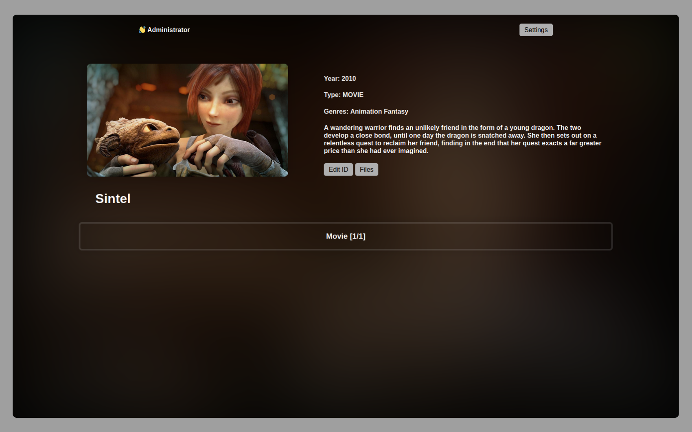
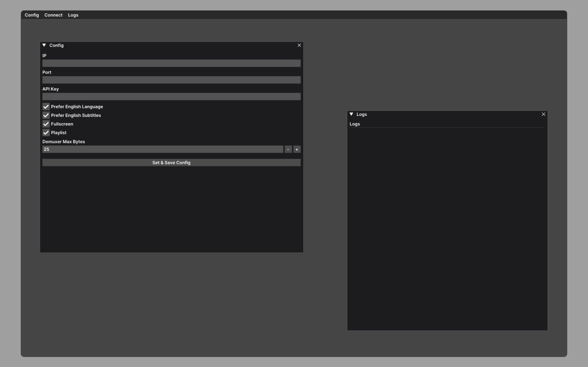

# ThinMedia
ThinMedia is a lightweight media management server designed to simplify the process of managing and playing your media files.

It is optimized for devices like the Raspberry Pi, leveraging a desktop player for MPV playback via HTTP download to eliminate the need for transcoding on the host side. This makes ThinMedia a compelling alternative to other media servers that may struggle with transcoding on lower-end hardware.

## Features
**Media Indexing:** ThinMedia uses APIs such as TMDB, Sonarr, and Radarr (WIP) to index your media files and create a database.

**Web UI:** Browse and edit your media files through a simple and intuitive web interface.

**Playback Requests:** You can request playback of your media files directly from the web UI, which will then be played on your local desktop player.

**Desktop Player:** The desktop player is designed to listen for the user's API key via a web websocket. It plays media or playlists via the MPV player, tracks watched media and playback time, and updates this information back to the server.

# Screenshots





# Installation and Run Instructions

## Setting up the Media Server
1. Navigate to the `ThinMedia` folder.
2. Install the required dependencies by running `pip install -r requirements.txt`.
3. Set up the configuration file at `data/indexer_config.json` with the following structure:

```json
{
    "paths": ["your", "media", "paths"],
    "indexer": "tmdb",
    "img_s": 720,
    "use_episode_img": true,
    "tmdb_api_key": "your TMDB api key"
}
```

4. Configure the settings in `app.py`.
5. Run `app.py`. Ensure that you have the necessary permissions to access and manage folders.

## Setting up the Desktop MPV Player

This requires MPV with libmpv to be installed on your system.

## GUI:
1. Navigate to the `gui-desktop-player-cpp` folder.
2. Make sure you have the required libraries installed as specified in the `CMakeLists.txt` file.
3. Use `cmake` to compile the source code. 
4. Run the player application.

## No GUI script:
1. Navigate to the `no-gui-desktop-player-python` folder.
2. Install the required dependencies by running `pip install -r requirements.txt`.
3. Set up the server configuration in `player.py`.
4. Run `player.py`.

# Work in Progress
Please note that ThinMedia is still a work in progress. You may encounter issues, and some features are still being developed.
